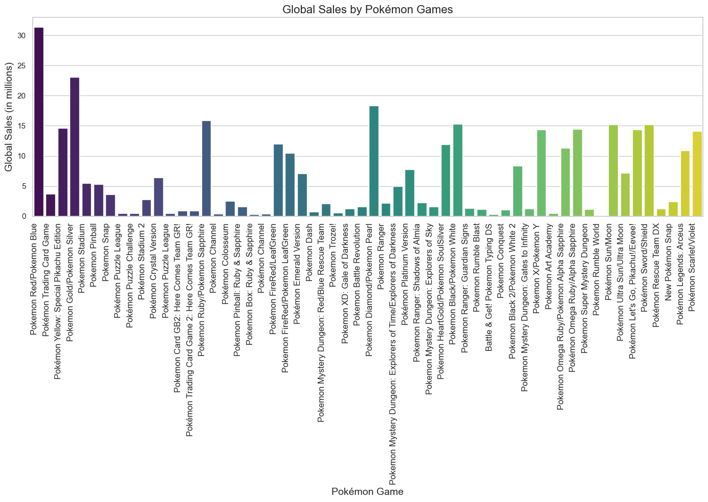
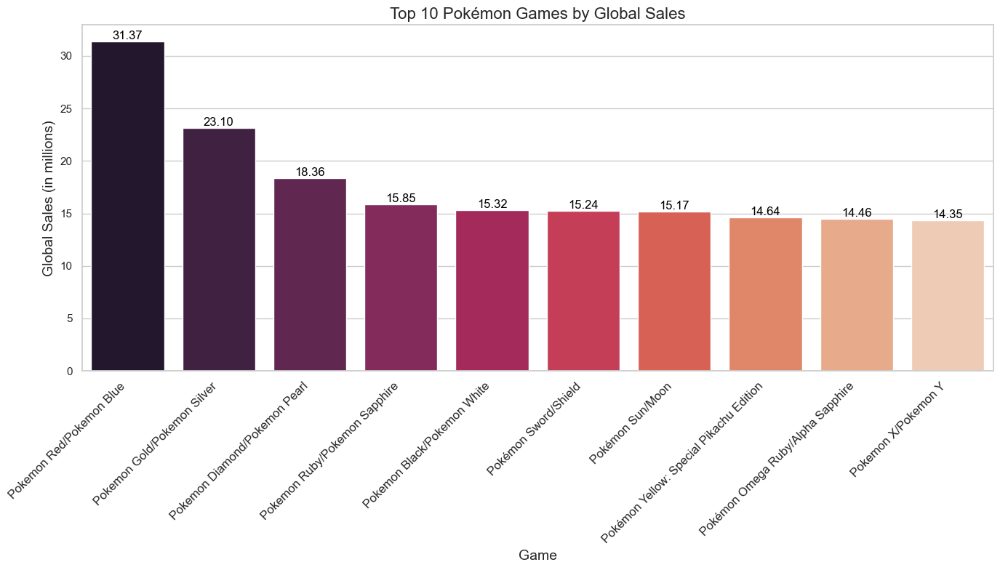
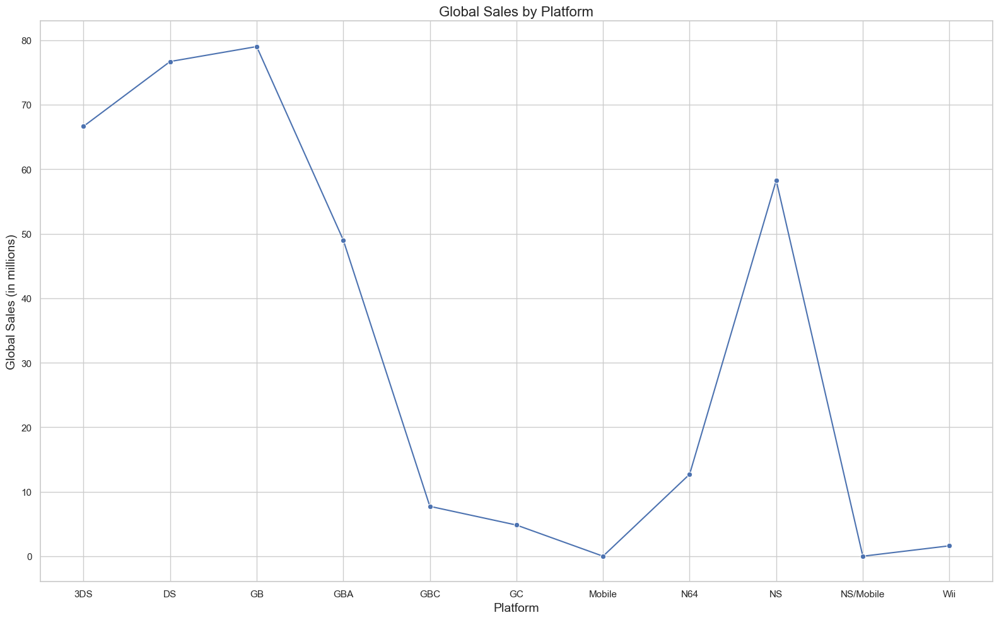
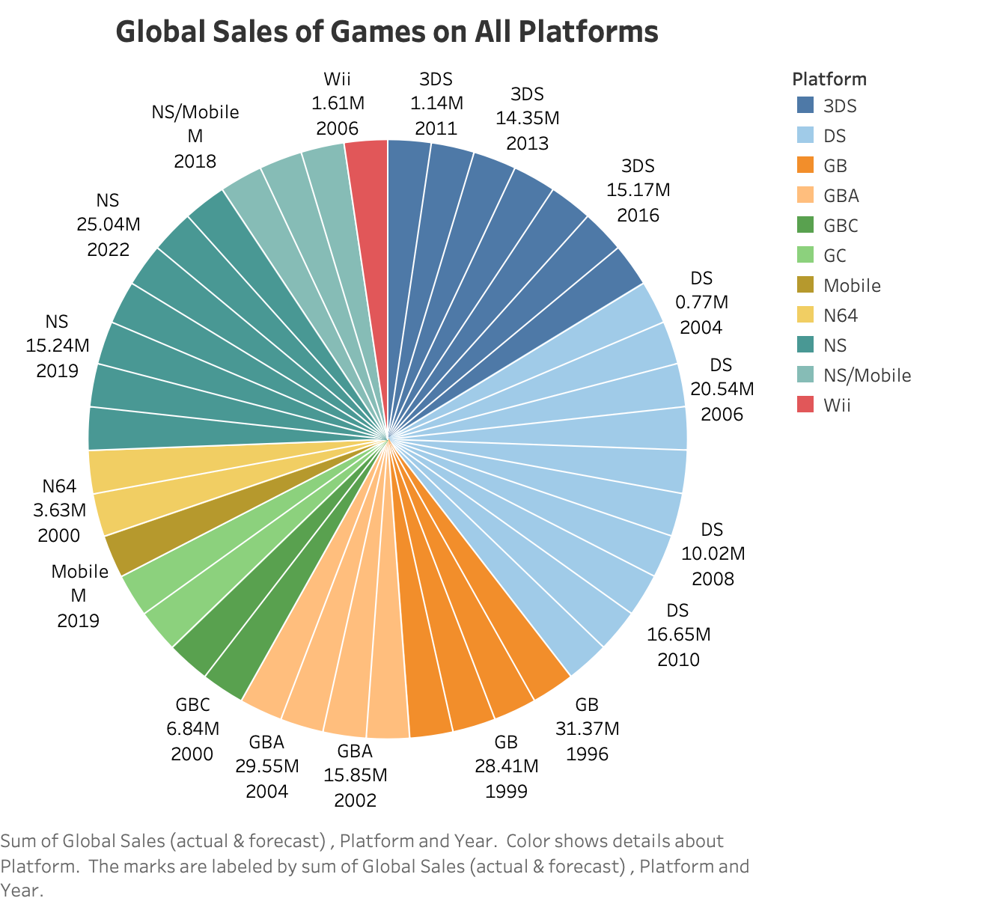
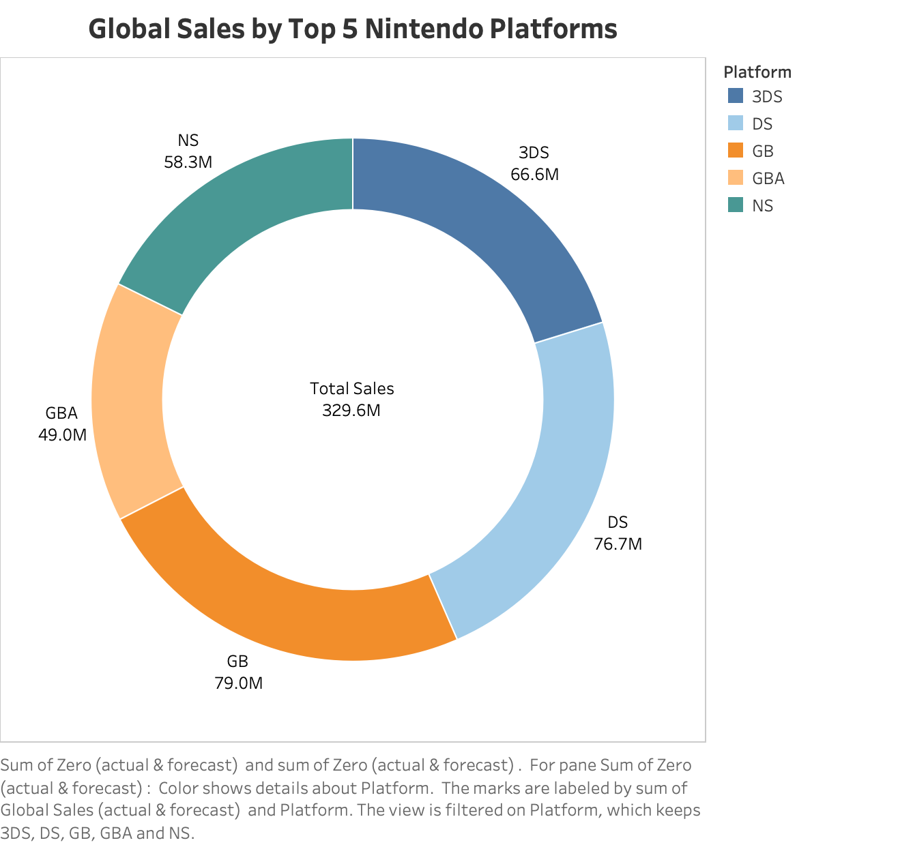
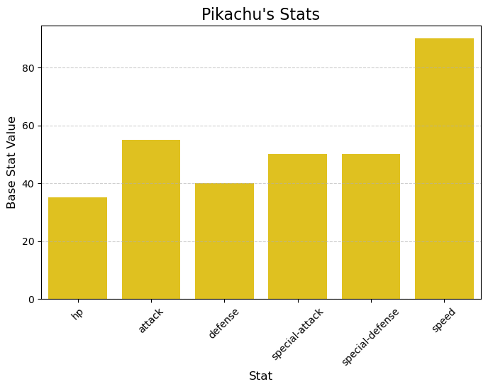
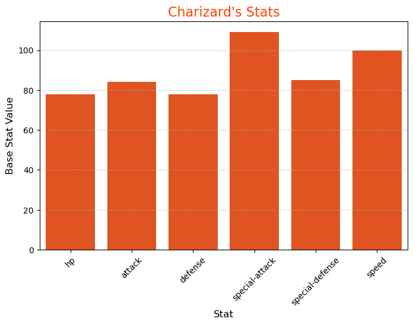
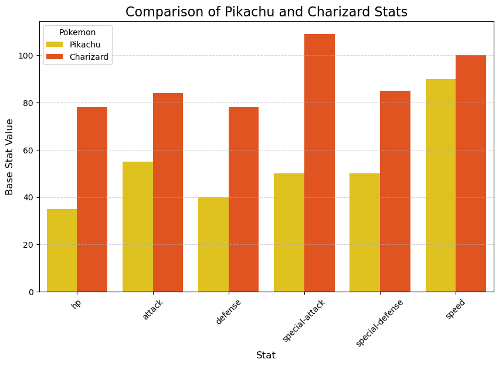

# Pokémon Analytics Project in Python

This project explores the evolution of Pokémon games' popularity using Python and integrates data from the VGChartz dataset and PokeAPI. By leveraging programming, analytics techniques, and Object-Oriented Programming (OOP) principles, this project aims to analyze Pokémon games' sales figures across different platforms and explore related data to uncover the franchise's enduring success.

---

## Project Overview

The objective of this project is to:

1. Analyze the global sales data of Pokémon games using the VGChartz dataset.  
2. Examine prominent Pokémon-specific base stats through the PokeAPI to explore their impact on the games' success.
3. Demonstrate skills in Python programming, data visualization techniques, and modular code design via OOP principles.

### Tools and Techniques Used:
- **Python Libraries**: `pandas`, `NumPy`, `matplotlib`, `seaborn`, `requests`, `Beautiful Soup`, `python-pptx`, `Pillow` 
- **Visualization**: Python (matplotlib, seaborn) with integrated images from Tableau.
- **Object-Oriented Programming**: Encapsulation of functionality into reusable classes (e.g., PokeAPI).

---

## Key Hypotheses

### 1. Dataset Hypothesis  
This analysis will quantitatively explore the relationship between global sales of Pokémon games and factors such as platform availability, regional sales trends, and franchise timeline. The idea is to investigate whether games released during periods of heightened franchise interest or on widely adopted platforms exhibit higher global sales.

### 2. API Hypothesis  
This exploration will qualitatively examine how intrinsic Pokémon characteristics might contribute to the appeal and popularity of the games they are featured in. The analysis will consider how Pokémon with pivotal roles in the storyline may influence player engagement and game reception.

---

## Getting Started: Setting Up the Project

### 1. **Install Prerequisites**  
To run this project locally, you must have the following installed:
- Python 3.8 or later  
- VS Code (with the Python extension installed)
- Required Python Libraries: These can be installed using `pip` within VS Code's terminal or using the "Python: Select Interpreter" command to select your Python environment and then installing packages via the Python Environments window.

### 2. **Clone the Repository**  
Clone the repository to your local machine using the following command:  

```bash
git clone https://github.com/BasirS/poke-analytics_project
```

### 3.  **Open the Project in VS Code:**
Open the project folder in VS Code.

### 4.  **Create or Select a Python Environment:**
*   VS Code will usually prompt you to select a Python interpreter. If it doesn't, use the "Python: Select Interpreter" command (Ctrl+Shift+P or Cmd+Shift+P).
*   VS Code can create a virtual environment for you automatically. If you choose an interpreter that is not already in a virtual environment, VS Code will offer to create one. This is the recommended approach.
*   If you choose to create a virtual environment yourself, run `python3 -m venv .venv` in the VS Code terminal, and then select that environment as the interpreter.

### 5.  **Install Required Libraries:**
Open a terminal in VS Code (View > Terminal) and navigate to the project directory, then install the required libraries from the `requirements.txt` file:
```bash
pip install -r requirements.txt
```

### 6.  **Run the Jupyter Notebooks:**
Open the Jupyter Notebooks (`.ipynb` files) in VS Code. You should be able to run the cells directly within the editor.

### 7. Set Up API Keys

#### PokeAPI Access  
PokeAPI is freely accessible, and no API key is required. You can directly make requests to its endpoints to retrieve Pokémon data.  

- An example API Endpoint for Bulbasaur:  

```bash
https://pokeapi.co/api/v2/pokemon/bulbasaur
```
<p align="center">OR</p>

```bash
https://pokeapi.co/api/v2/pokemon/1
```

- For more information on endpoints and data structures, visit the PokeAPI Documentation <a href="https://pokeapi.co/docs/v2" title="Official PokeAPI Documentation" target="_blank">here</a>.

#### Config File for Other APIs (optional)  
If you use additional APIs for your project which require keys, make sure to store them in a file named `config.py` in the following format:

```python
OTHER_API_KEY = "your_other_api_key_here"
```

---

## Data Sources

### VGChartz Dataset  
- **Source**: The VGChartz dataset provides global sales data for video games, including Pokémon titles.  
- **Purpose**: This dataset serves as the foundation for analyzing Pokémon game sales and identifying trends across regions and platforms.  

### PokeAPI  
- **Purpose**: PokeAPI offers comprehensive data on individual Pokémon, including stats, types, and abilities.  
- **Usage**: In this project, PokeAPI is used to retrieve and visualize the *base stats* of selected Pokémon.

For example, starter Pokémon are an important part of the player experience, and their design can be a significant factor in a game's initial appeal.

---

## Data Visualizations and Interpretations

### 1. Global Sales by Pokémon Game 
---
#### Insight 1: What makes the top-selling Pokémon games so successful?


* The bar chart offers a comprehensive look at Pokémon's global sales across its entire game library, showing how the franchise has stayed relevant for decades. From the groundbreaking success of **Red/Blue (31.37 million)** to modern hits like **Sword/Shield (15.24 million)**, it’s clear that Pokémon thrives by adapting to new platforms while maintaining its core appeal. Mainline titles dominate, but spin-offs like **Mystery Dungeon** and remakes such as **HeartGold/SoulSilver** demonstrate how nostalgia and experimentation keep the fanbase engaged.

* It’s also interesting to see how Pokémon's success aligns with major platform shifts, like the DS's Wi-Fi connectivity or the Switch's hybrid design, showing how the franchise smartly leverages technological advancements to draw in both old and new players. At its core, Pokémon’s ability to innovate while respecting its roots has solidified its place as a global gaming phenomenon.


* Now, the second bar chart showcases the global sales data for the top 10 best-selling Pokémon games. It highlights the enormous popularity of **Pokémon Red/Blue**, leading the list with an impressive **31.37 million units** sold, followed by **Pokémon Gold/Silver** at **23.10 million units**. This significant gap indicates how the first-generation games established the foundation for the franchise's enduring success. Factors such as the novelty of the Pokémon concept, the introduction of link cable trading, and the nostalgia associated with these titles have contributed to their monumental success.

* Other high-ranking entries like **Pokémon Diamond/Pearl (18.36 million)** and **Ruby/Sapphire (15.85 million)** reflect how iterative improvements, new mechanics, and fresh regions continued to engage audiences over the years. The consistent sales starting from **Pokemon Black/Pokemon White** and across newer titles suggest that nostalgia, coupled with innovations, played a critical role in maintaining Pokémon’s dominance in the gaming industry.
---

#### Insight 2: How do sales trends correlate with the platform used and the release year?


* The line chart analyzes global sales trends across various platforms, illustrating the pivotal role hardware plays in the franchise's success. The **Game Boy (GB)** emerges as the most successful platform, generating close to **80 million units** in sales, reflecting its broad market penetration and compatibility with multiple Pokémon titles. Similarly, platforms like the **Nintendo DS (DS)** and **Game Boy Advance (GBA)** sustain the trend of high sales during their respective peaks.

* However, the chart also reveals dips in sales for platforms like the **GameCube (GC)** and **Mobile**, emphasizing the importance of accessible and popular hardware in driving game success. The spike in sales for the **Nintendo Switch (NS)** highlights the impact of modern hybrid gaming experiences, overall reflecting Pokémon’s ability to adapt and thrive with changing player preferences, and ultimately improving their revenue.


* This Tableau visualization depicts a pie chart that provides an overview of Pokémon game sales across various platforms and release years. From the visualization, it's evident that earlier platforms like the **Game Boy (GB)** and **Game Boy Advance (GBA)** played a foundational role in establishing Pokémon as a blockbuster franchise, with combined sales exceeding **79 million units (79M)** and **49 million units (49M)**, respectively. These platforms represent the franchise's formative years, where games like *Pokémon Red*, *Blue*, and *Emerald* capitalized on the novelty of portable gaming and simple yet immersive mechanics.

* In contrast, newer platforms like the **Nintendo Switch (NS)** and **3DS** reflect Pokémon’s ability to stay relevant by evolving with technology. The Nintendo Switch alone boasts sales of over **25 million units (25M)** for Pokémon titles in **2022**, which correlates with its versatility as both a handheld and docked console. Similarly, the 3DS saw sales spikes during its peak years in **2013 (14.35M)** and **2016 (15.17M)**, coinciding with the release of highly anticipated titles like *Pokémon X/Y* and *Pokémon Sun/Moon*.

* The timeline reveals that platform adoption and hardware capabilities heavily influence game sales. For example, the **GameCube (GBC)** and **Nintendo 64 (N64)** had lower contributions to Pokémon sales due to their limited portable appeal, compared to handheld-focused devices that align better with the franchise's design philosophy. Additionally, the dominance of mobile platforms in **2016** (with the release of Pokémon GO - not included in the data) speaks for itself on how Pokémon successfully leveraged emerging trends in casual and mobile gaming to expand its audience.


* Following up with the above one is another Tableau visualization—a donut chart, which depicts the significance of the most popular platforms of all time, accounting for a notable share of the total **329.6 million (M)** global sales. The **DS (76.7M)**, for example, demonstrates the success of innovative features like dual screens and Wi-Fi connectivity, which were instrumental in the popularity of games like *Pokémon Diamond/Pearl* and *HeartGold/SoulSilver*.

* The transition to the **3DS (66.6M)** showcases a natural progression, with Nintendo capitalizing on backward compatibility and improved hardware, ensuring a seamless shift in player loyalty. Similarly, the **GBA (49M)** served as a pivotal platform for Pokémon's evolution, introducing fan-favorite titles like *Ruby/Sapphire* while setting the stage for later advancements.

* The **Nintendo Switch (58.3M)** marks a new era of Pokémon games, offering HD visuals and open-world exploration that appeals to both nostalgic fans and newer audiences. This aligns with broader gaming trends, where hybrid consoles appeal to diverse player preferences, from casual to competitive.
---

### 2. Pokémon Traits and Success  
Two of the most iconic Pokémon, **Pikachu** and **Charizard**, have played pivotal roles in the franchise's popularity, particularly within the beloved Kanto region. Their distinct designs and in-game characteristics have undoubtedly contributed to their appeal and the success of the games they feature in.

---
<div align="center">
  
</div>
<p align="center">Let's Go Pikachu - The Face of Pokémon</p>

<div align="center">
  
</div>
<p align="center">Game Boy Charizard - The Most Popular Pokemon</p>

---
The ***Kanto*** region, featured in the original Pokémon Red, Blue, and Yellow (as well as their remakes), remains one of the most popular and recognizable settings in the Pokémon world. The choice of starter Pokémon in these games: Bulbasaur, Charmander (evolving into Charizard), or Squirtle, is a key early-game decision that significantly influences the player's experience.
---


---
<div align="center">
  
</div>

* The selection of Pikachu as the starter Pokémon in Pokémon Yellow, a special edition released shortly after Red and Blue, further cemented its status as a mascot for the franchise. This game remarkably followed the anime's storyline, where Ash Ketchum begins his journey with Pikachu. This close tie-in with the anime, a major driver of Pokémon's popularity, likely contributed to Yellow's commercial success. While Pikachu's base stats, as seen in the individual visualization, are generally balanced with a focus on Speed, its unique gameplay mechanics in Yellow, such as following the player on the overworld and having unique interactions, added a new layer of engagement that distinguished it from previous titles.


---
<div align="center">
  
</div>

* Charizard, the final evolution of Charmander, is a powerful Fire/Flying-type Pokémon with a striking design. Its high Attack, Special Attack, and Speed stats, as demonstrated in the individual visualization, make it a formidable opponent in battles, contributing to its popularity among players. The desire to train and evolve Charmander into the powerful Charizard likely drove player engagement in Pokémon Red and Blue, contributing to their commercial success. The fact that Charizard is the final evolution of Charmander, which is a popular fire type pokémon in the Kanto region, makes it very appealing to players.


---
<div align="center">
  
</div>

* **The comparison of Pikachu and Charizard's stats, as visualized in the combined bar chart, highlights their different strengths. Charizard boasts significantly higher Attack, Special Attack, and Special Defense, solidifying its role as a powerful offensive and special wall Pokémon. While Pikachu excels in Speed, its other stats are considerably lower than Charizard's. This difference in stats further reaffirms their distinct roles within the games and contributed to their individual appeal to different player preferences. Charizard's power fantasy is definitely a part of why it's so popular till today.**

---

## Complications  
I found myself stuck in the frustrating role of a  "*digital janitor*" spending countless days trying to clean data scraped from VGChartz. After 3–4 grueling days of trial and error, I had to wave the white flag and accept that I couldn’t make the scraped data usable. As a last resort, I turned to an [outdated Kaggle dataset](https://www.kaggle.com/datasets/gregorut/videogamesales) from 2016—yes, a dataset that’s 8 years old! To bring it closer to 2023, I manually updated the dataset using information directly from the [VGChartz](https://www.vgchartz.com/game/226034/pokemon/?region=All) website and the [Nintendo Financial Report Results](https://www.nintendo.co.jp/ir/en/finance/software/index.html) website. It was an exhausting and time-consuming process, but that was the only way left for me to succeed in an analysis–if any. Click [here](https://github.com/BasirS/poke-analytics_project/tree/main/vgchartz) if you want to witness how the lack of proper training in data cleaning during my coursework turned me into such a novice when dealing with even a relatively small dataset. This experience made me painfully aware of how much more I need to learn to handle real-world big data challenges effectively.

---

## Conclusion  

* This project set out to explore the factors contributing to the Pokémon franchise's enduring success by analyzing global game sales data and examining key Pokémon characteristics. Through visualizations of sales data from VGChartz (supplemented with data from Kaggle and Nintendo's financial reports) and base stats retrieved from the PokeAPI, several key insights could be recognized.

* The analysis of global sales data revealed clear trends related to platform adoption and release timing. The **Nintendo DS** proved to be a particularly successful platform for Pokémon games, demonstrating the importance of hardware accessibility and innovative features. I also observed that releases coinciding with new generations or major franchise events tended to drive higher sales, highlighting the impact of marketing and franchise momentum.

* Furthermore, our exploration of Pokémon traits, focusing on iconic Pokémon like Pikachu and Charizard, revealed how design and in-game characteristics can contribute to a game's appeal. The choice of starter Pokémon, a crucial early-game decision, plays a significant role in player engagement. Pikachu's unique mechanics in Pokémon Yellow, combined with its status as the franchise mascot, undoubtedly contributed to that game's success. Charizard's powerful stats and striking design, making it a highly desirable Pokémon, likely drove player engagement in Pokémon Red and Blue.

* This project wasn't without its challenges. The initial attempt to scrape data directly from VGChartz proved significantly more difficult than anticipated, requiring a substantial time investment in data cleaning. Ultimately, an older Kaggle dataset, updated with data from VGChartz and Nintendo's financial reports, provided a more viable foundation for analysis. This experience underscored the importance of robust data cleaning skills and gave me a realization of areas for future development. While there are more elements to explore in future projects, such as connecting pokemon traits to game sales more directly, this project provided a valuable glimpse into the factors that have shaped the Pokémon franchise's remarkable success.

## Future Enhancements  
Through this analysis, I believe I successfully addressed all the key points I initially set out to explore, combining my lifelong passion for Pokémon with the data analysis skills I honed in my Programming for Analytics course. That said, I can’t help but feel there’s so much more I could’ve uncovered. I wish I had the time to dive deeper into connecting the sales data with the vast array of Pokémon traits, making the analysis even more thorough and nuanced. Despite this, I’m proud of the work and research I’ve done here. If time constraints weren’t a factor, I would have absolutely taken it further, creating a more comprehensive connection between Pokémon traits and their lasting success.

---

## Your Suggestions  

Any ideas on how I can further enhance this analysis? Feel free to contribute or share ideas via GitHub :)
